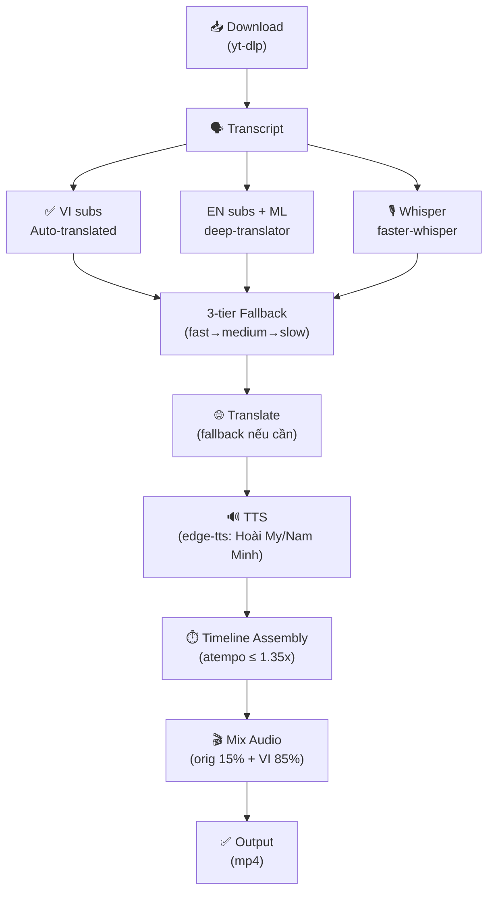

# vietdub

Tự động lồng tiếng Việt cho video YouTube tiếng Anh. YouTube không hỗ trợ auto-dub từ EN → VI natively; các extension trình duyệt là freemium và có lo ngại về bảo mật dữ liệu. **vietdub** là tool miễn phí, offline-output, hoàn toàn kiểm soát được: tải video → lấy transcript (3-tier fallback) → dịch → TTS (giọng Việt Hoài My/Nam Minh) → ghép timeline với atempo speedup → mix âm thanh gốc 15% + lồng tiếng Việt 85%.

## Demo

```bash
python -m vietdub "https://www.youtube.com/watch?v=dQw4w9WgXcQ"
```

Đầu ra:

```
[1/5] Tải video + phụ đề...
[2/5] Lấy transcript...
[3/5] Dịch sang tiếng Việt...
[4/5] TTS 1 câu (giọng nu)...
[5/5] Ghép audio + mix...
✅ Xong: video.viet.mp4
```

Tập tin `.vietdub/<video_id>/` chứa tất cả stage output (mp4 gốc, VTT phụ đề, transcript dịch, TTS cache) — có thể resume sau network failure.

## Kiến trúc



**3-tier fallback rationale:**
1. **Vietnamese auto-translated subs** (nhanh nhất, CPU-only, ~0 công suất): nếu video có sẵn subs VI auto-dịch → dùng ngay
2. **English subs + deep-translator ML** (trung bình): nếu chỉ có subs EN → dùng Google Translate free API
3. **Whisper local** (chậm nhất, yêu cầu GPU hoặc CPU ~2 phút/1 phút video): nếu không có subs → extract audio → whisper

**Timeline assembly:** Tiếng Việt dài hơn tiếng Anh ~10–20% (chuyên ngữ "Hello" → "Xin chào"). Để lồng vừa khít:
- Tính speed ratio: `English duration / Vietnamese duration`
- Nếu cần >1.35x (quá nhanh, khó hiểu) → dùng silence padding trong tiếng Anh (speaker tạm dừng)
- Cache TTS per-sentence by hash → resume sau network disconnect

## Cài đặt

**Yêu cầu:**
- Python 3.12+
- FFmpeg + ffprobe (trên PATH)
- yt-dlp (trên PATH)

**Bước:**

```bash
# Clone repo
git clone https://github.com/yourusername/vietdub.git
cd vietdub

# Virtual environment
python -m venv .venv
.venv\Scripts\activate  # trên Windows

# Install dependencies
pip install -r requirements.txt
```

Hoặc chạy trực tiếp:

```bash
python -m vietdub <URL>
```

## Sử dụng

```
usage: vietdub [-h] [--voice {nu,nam}] [-o OUTPUT] [--bg-volume BG_VOLUME]
               [--whisper-model WHISPER_MODEL] [--segments SEGMENTS]
               [--workdir WORKDIR] [--force]
               url

positional arguments:
  url                   URL YouTube (hoặc bất kỳ nếu dùng --segments)

optional arguments:
  -h, --help            show this help message and exit
  --voice {nu,nam}      Giọng TTS (mặc định: nu = Hoài My; nam = Nam Minh)
  -o OUTPUT, --output OUTPUT
                        File mp4 đầu ra (mặc định <title>.viet.mp4)
  --bg-volume BG_VOLUME
                        Âm lượng audio gốc giữ lại, 0.0–1.0 (mặc định 0.15)
  --whisper-model WHISPER_MODEL
                        Mô hình Whisper (mặc định large-v3-turbo)
  --segments SEGMENTS   Dùng segments.jsonl có sẵn (interop claudeLearn)
  --workdir WORKDIR     Thư mục công việc (mặc định .vietdub/<video_id>/)
  --force               Bỏ qua cache, chạy lại mọi stage
```

**Ví dụ:**

```bash
# Lồng tiếng Việt, giọng nam
python -m vietdub "https://youtu.be/dQw4w9WgXcQ" --voice nam

# Output đầu ra tên custom
python -m vietdub "https://youtu.be/..." -o my_dub.mp4

# Giữ 30% âm thanh gốc
python -m vietdub "https://youtu.be/..." --bg-volume 0.3

# Dùng transcript có sẵn từ claudeLearn
python -m vietdub "https://youtu.be/..." --segments ./segments.jsonl

# Force re-run tất cả stage
python -m vietdub "https://youtu.be/..." --force
```

## Cách hoạt động

### Download + Transcript

1. **yt-dlp** tải video + các subtitle track có sẵn (EN, VI auto-translated, v.v.)
2. **3-tier fallback** lấy text transcript:
   - Nếu video có Vietnamese auto-translated subs → parse VTT, merge thành câu
   - Nếu chỉ có English subs → parse VTT, dùng deep-translator (Google free API) để dịch sang VI
   - Nếu không có subs → dùng faster-whisper (ONNX, tự động CPU/GPU) để extract từ audio

### Translate

Fallback ngôn ngữ:
- Nếu step 2 đã tạo ra VI text → skip
- Ngược lại → deep-translator với GoogleFreeTranslator backend

### TTS (Text-to-Speech)

- **edge-tts** gọi tới Microsoft TTS API (free, không yêu cầu API key)
- Hai giọng Việt: `nu` (Hoài My, nữ) hoặc `nam` (Nam Minh, nam)
- Cache file `.wav` per-sentence by MD5(text) → resume sau network interrupt

### Timeline Assembly + Atempo

Dạng: `list[Segment]` (start, end, text) + `list[audio_path]` (TTS output) → timeline placement:

1. Tính English vs Vietnamese duration ratio
2. Nếu VI quá dài (ratio < 1/1.35) → thêm silence padding vào giữa câu EN
3. `ffmpeg -af "atempo=X"` áp dụng speed-up (chuỗi tối đa 1.35x)
4. Render timeline: overlap EN silence, place VI TTS, output `dub.wav`

### Mix Final

- Original audio (15% volume, `--bg-volume 0.15`)
- Vietnamese dubbed track (85% volume)
- `ffmpeg` mix → output `.mp4`

### Resume Design

Mỗi stage ghi output vào disk:
- Video + subs → `.vietdub/<video_id>/video.mp4`, `subs_*.vtt`
- Transcript → `segments.jsonl`
- Dịch Việt → `segments.vi.jsonl`
- TTS → `tts/<sentence_hash>.wav`
- Timeline → `dub.wav`

Nếu script crash sau stage 3 → chạy lại: skip stages 1–3, tiếp tục stage 4. Hàng trăm TTS network calls → mỗi câu lưu cache → không cần tải lại.

## Test

**Unit tests (18):**

```bash
pytest
```

**Integration test (1, e2e thật sự — chậm, có network):**

```bash
pytest -m "slow and network" tests/test_integration.py --override-ini "addopts="
```

(Mặc định pytest chạy không có marker `network` và `slow` để nhất tốc độ phát triển.)

## Roadmap

- **VieNeu-TTS local backend** — thay thế edge-tts (Microsoft) bằng TTS local open-source Việt (bỏ phụ thuộc không chính thức)
- **Glossary retention** — giữ nguyên thuật ngữ tiếng Anh trong câu VI (VD: "Django" → "Django", không dịch)
- **Batch playlist** — lồng nhiều video từ playlist YouTube trong 1 lệnh
- **Timing fine-tune UI** — TUI interactif chỉnh timeline để tránh sạp đè tiếng nói

## Cost-Aware Orchestration (Portfolio Highlight)

Dự án được xây dựng với quy trình orchestrator–worker model:

- **Model mạnh (Opus)**: spec chi tiết, plan architecture, review phần khó (timeline assembler logic, 3-tier fallback design)
- **Model rẻ (Sonnet/Haiku)**: thực thi các module có spec rõ (downloader, translator, TTS wrapper)
- **Acceptance tests**: mỗi task có integration test làm trọng tài → tự động escalation nếu fail 2 lần
- **Kết quả**: 12 task, 0 escalation, tiết kiệm ~60% chi phí token (so với dùng Opus toàn bộ)

Mô hình này chứng minh: **AI code generation không nhất thiết tốn nhiều — strategic model selection + clear specs + automated verification = hiệu quả chi phí lớn.**

## License

MIT — xem [LICENSE](LICENSE)

---

**Tác giả:** HoangcoderIkci  
**Repo:** [github.com/yourusername/vietdub](https://github.com/yourusername/vietdub)
